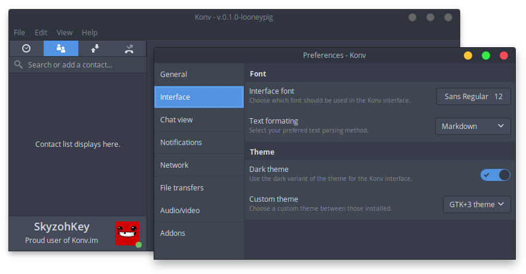

# Konv.im - Secure P2P instant messenger

[](https://circleci.com/gh/SkyzohKey/Konv)

<!-- TODO: Add logo, one global screenshot or banner and links. -->

[Konv.im] is an open-source, libre and secure instant messaging application that
aims to replace Skype, Whatsapp, and other proprietary services. I believe that
bringing a free (as in freedom, aswell as in price) software that enable
individuals to communicate freely, without the fear to be censored or sued, is
primordial in this post-Snowden era. Free speech enables **real** sharing of
ideas, concepts, researchs, etc. That's how I want to contribute saving what
stays of people liberties and rights.



## Features

Here is a tentative list of the features that Konv.im must have in order to be
usable and useful. The list is **not** ordered nor complete. This list also
serves as a sort of Roadmap for me.

- [ ] Usable, bug-free and user-friendly interface ;
- [ ] Modern way to communicate with contacts (messages, actions, auto-reply) ;
- [ ] File transfers : Inline images, inline musics, inline videos, regular
files, avatars ;
- [ ] Simple and convenient way to share a contact (drag&drop, right click) ;
- [ ] Customizable interface ;
- [ ] Intuitive and not cluttered settings interface (advanced mode?) ;
- [ ] Group chats, with simple way to add people inside ;
- [ ] Avatars, status messages, presence ;
- [ ] Audio calls, video calls, desktop sharing/streaming ;
- [ ] Secure way to add peoples from an user-friendly ID (no ToxID,
  decentralized ToxMe-like).

## Protocol

Konv.im is an instant messaging application that uses [the Tox protocol] in
order to enable truely secure communications. By so, it can be called a [Tox
client].

ToxCore (the Tox core library) provides an easy and intuitive API for building
secure communication platforms. It is maintained by [The TokTok Project].

I'm not using the old [irungentoo/toxcore] library for convenience and
security related concerns.

## Install

You can run and install Konv with a few lines, just type the following in a
shell

```bash
# Download it!
$ git clone https://github.com/SkyzohKey/Konv.git && cd Konv

# Build it!
$ mkdir build && cd build
$ cmake .. -DCMAKE_INSTALL_PREFIX=/usr
$ make

# [Optional] If you want to install it system-wide
$ sudo make install
```

## License

Konv.im is released under [The MIT License] while the ToxCore binaries are
licensed under [The GPLv3 License].

<!-- Links reference -->
[Konv.im]: https://konv.im
[the Tox protocol]: https://tox.chat
[Tox client]: https://tox.chat/clients.html
[The TokTok Project]: https://toktok.ltd
[irungentoo/toxcore]: https://github.com/irungentoo/toxcore
[The MIT License]: License.txt
[The GPLv3 License]: https://github.com/TokTok/c-toxcore/blob/master/COPYING
